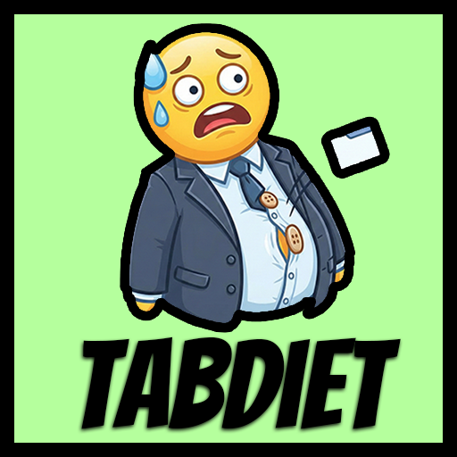
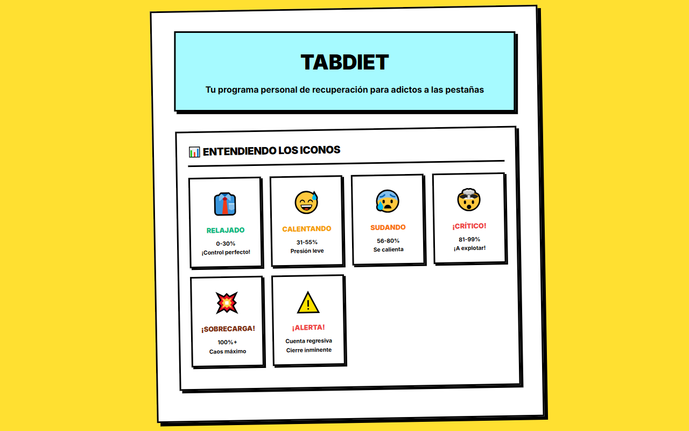
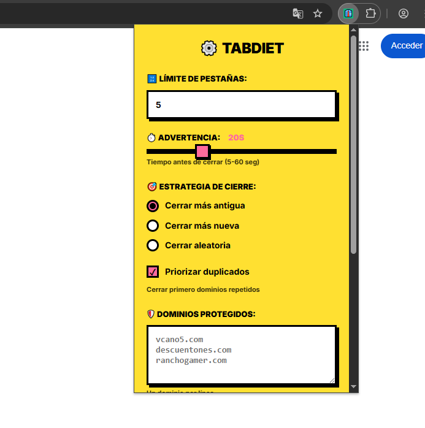
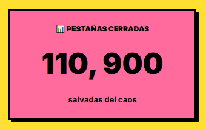
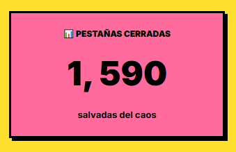

# TabDiet 🍽️

<p align="center">
  
</p>

<p align="center">
  <strong>¿191 pestañas abiertas? Been there.</strong>
</p>

<p align="center">
  TabDiet te pone un límite duro y, si lo pasas, espera 20 segundos… y cierra una pestaña (vieja, nueva o aleatoria, tú eliges).
</p>

---

## ✨ Características

- 🎯 **Límite configurable** - Establece tu propio límite de pestañas (recomendado: 12)
- ⚡ **3 estrategias de cierre**:
  - 🕒 Más antigua - Cierra la pestaña que llevas más tiempo sin usar
  - 🆕 Más nueva - Cierra la pestaña más reciente
  - 🎲 Aleatoria - Sorpresa! (para los aventureros)
- 🎨 **Icono inteligente** - Te advierte cuando te acercas al límite y "explota" cuando lo superas
- 📊 **Estadísticas** - Lleva la cuenta de cuántas pestañas has cerrado
- 📌 **Protección inteligente** - Las pestañas ancladas y páginas de Chrome están protegidas
- ⏱️ **Tiempo de advertencia configurable** - Por defecto 20 segundos antes de cerrar
- 🔍 **Priorizar duplicados** - Cierra primero las pestañas duplicadas
- 📝 **Lista blanca** - Protege URLs específicas de ser cerradas

## 📸 Capturas de pantalla

<p align="center">
  
  
</p>

<p align="center">
  
  
</p>

## 🚀 Instalación

Como TabDiet aún no está en la Chrome Web Store, deberás instalarla manualmente:

### 1. Descargar el código

```bash
git clone https://github.com/vcano5/tabdiet.git
cd tabdiet
```

O descarga el repositorio como ZIP y descomprímelo.

### 2. Cargar la extensión en Chrome

1. Abre Chrome y ve a `chrome://extensions/`
2. Activa el **"Modo de desarrollador"** (esquina superior derecha)
3. Haz clic en **"Cargar extensión sin empaquetar"**
4. Selecciona la carpeta `src` dentro del directorio de TabDiet
5. ¡Listo! El icono de TabDiet debería aparecer en tu barra de herramientas

### 3. Configurar tus preferencias

1. Haz clic en el icono de TabDiet en la barra de herramientas
2. Ajusta el límite de pestañas (por defecto: 5)
3. Elige tu estrategia de cierre favorita
4. Configura el tiempo de advertencia
5. Guarda los cambios

## 🎮 Cómo usar

1. **Navega normalmente** - TabDiet trabaja en segundo plano
2. **Observa el icono** - Cambia de color cuando te acercas al límite
3. **Recibe advertencias** - Cuando superas el límite, tienes 20 segundos (configurable)
4. **Deja que funcione** - Si no cierras pestañas manualmente, TabDiet lo hace por ti

### Estados del icono

- 👔 **Relajado** (0-30%) - ¡Control perfecto!
- 😅 **Calentando** (31-55%) - Presión leve
- 😰 **Sudando** (56-80%) - Se calienta
- 🤯 **¡Crítico!** (81-99%) - ¡A explotar!
- 💥 **¡Sobrecarga!** (100%+) - Caos máximo
- ⚠️ **¡Alerta!** - Cuenta regresiva, cierre inminente

## ⚙️ Configuración

### Límite de pestañas
Establece el número máximo de pestañas que quieres tener abiertas (recomendado: 8-15).

### Estrategias de cierre

- **Más antigua**: Cierra la pestaña que llevas más tiempo sin visitar
- **Más nueva**: Cierra la pestaña más recientemente abierta
- **Aleatoria**: Cierra una pestaña al azar (para sentir la adrenalina)

### Tiempo de advertencia
Segundos que tienes para cerrar pestañas manualmente antes de que TabDiet lo haga por ti (por defecto: 20s).

### Priorizar duplicados
Si está activado, TabDiet cerrará primero las pestañas con URLs duplicadas.

### Lista blanca
Añade URLs (una por línea) que quieres proteger de ser cerradas automáticamente.

## 🛠️ Tecnologías

- Chrome Extension Manifest V3
- Vanilla JavaScript
- CSS (con estilo neobrutalism)
- Chrome Storage API
- Chrome Tabs API
- Chrome Alarms API

## 📊 Estadísticas

TabDiet lleva un registro de:
- Número total de pestañas cerradas
- Fecha de primera instalación

## 🤔 ¿Por qué TabDiet?

Hecha porque ya no podía más con cientos de pestañas abiertas ralentizando mi navegador y mi productividad.

Si eres de los que tiene 50+ pestañas abiertas "por si acaso", TabDiet es para ti. Es como tener un entrenador personal para tus pestañas. Duro, pero justo.

## 📝 Licencia

MIT License - Siéntete libre de usar, modificar y distribuir.

## 🤝 Contribuciones

¡Las contribuciones son bienvenidas! Si tienes ideas para mejorar TabDiet:

1. Fork el proyecto
2. Crea una rama para tu feature (`git checkout -b feature/AmazingFeature`)
3. Commit tus cambios (`git commit -m 'Add some AmazingFeature'`)
4. Push a la rama (`git push origin feature/AmazingFeature`)
5. Abre un Pull Request

## 🐛 Reportar bugs

Si encuentras algún bug, por favor abre un issue en GitHub con:
- Descripción del problema
- Pasos para reproducirlo
- Comportamiento esperado vs. actual
- Screenshots (si aplica)

---

<p align="center">
  <strong>¡Empieza tu dieta de pestañas hoy!</strong>
</p>

<p align="center">
  Hecho con ❤️ (y frustración por demasiadas pestañas)
</p>
